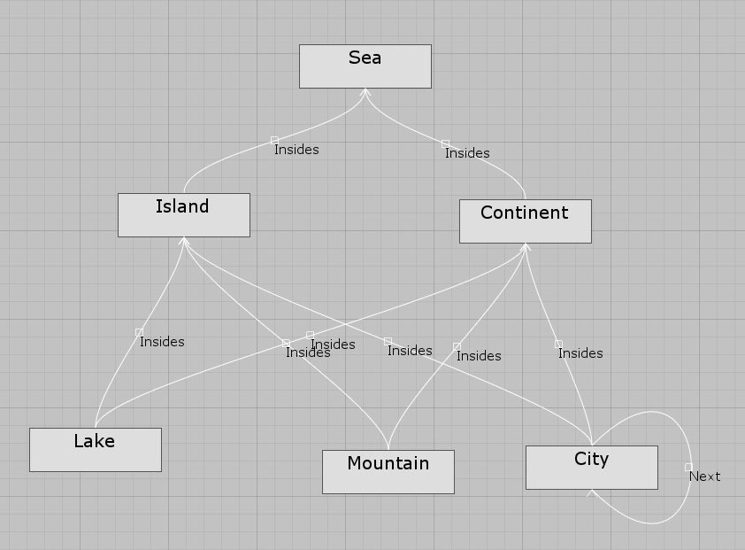

# Map-Generation
## Description

Map-Generation is  prototype model-based game world map generator integrated with Unity.

- [Description](#descriotion)
- [Scope](#scope)
- [Installation](#installation)
- [Geting Started](#geting-started)

## Scope 
- Investigate the usage of model-based techniques in the context of game map generation
- Easy to use map generation tools
- Provide consistency guarantees in terms of constraints during the map generation process

## Installation
1. Install [Java](https://www.oracle.com/ca-en/java/technologies/javase-downloads.html) (After 1.8).
2. Install the latest version of [Unity](https://unity.com/)
3. Create a new unity project
4. Clone the repository
5. Copy the "Map Generation/Assets/MapGenerator" folder into the **Asset** folder of the new project
6. Restart Unity

If the installation is successfull, you should see a **Graph Editor** option available under the **Window** tab.

## Geting Started
- Open the Graph Editor window, a graphical configurator of the setup will shown.  

- Right Click on the left part of the window to create a new node. A node represents a region type in the map. 

- Click on a node shows the generation configuration of the node.  

- Right click on a node can add a connection. A sample configuration graph is shown below: 

- Currently the constraints for **Insides** edge type is auto-generated, while the constraints for other edge type can be specified as  [Viatra Query Language](https://www.eclipse.org/viatra/documentation/query-language.html).
- Extra constraint file can be added using the option at the right bottom corner.
- Drug the **MapGenerator prefab** in the MapGenerator folder to the desired game scene.
- When ready, press generate and a Terrain Mesh will be generated to the **MapGenerator prefab**. A sample result is shown below:  

